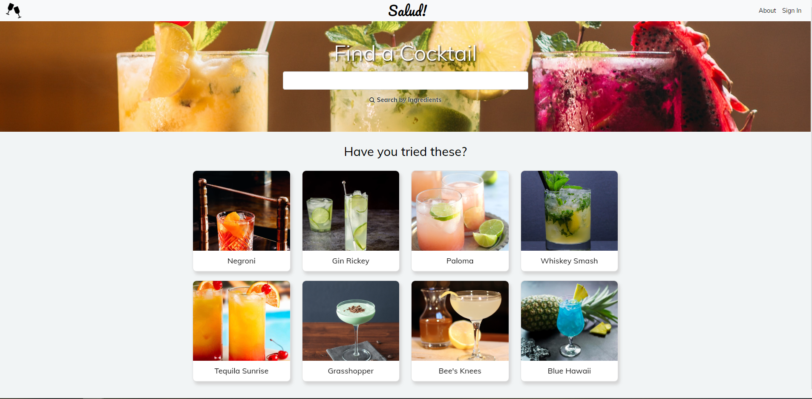

# Salud! 

Salud! was a labor of love for its creators. In the week and a half we had to
build Salud!, we learned and implemented both Angular and JSON Web Tokens. We
built our database from scratch using MySQL and Sequelize, and used ngBootstrap
for front-end styling. The idea grew from a desire to have a lightweight,
unintrusive way to find and save our favorite cocktail recipes. We hope this app
makes the good times better for anyone who uses it!

## Live Site

https://salud-cocktails.herokuapp.com

## User Story

AS A Cocktail Enthusiast  
I WANT TO find and save my favorite cocktail recipes  
SO THAT I don't have to google things every time

## Acceptance Criteria

GIVEN I want to find a new cocktail  
WHEN I navigate to the Salud! webpage  
THEN I am presented with a clean, functional UI  
GIVEN I want to search for a cocktail by name  
WHEN I enter that name into the search bar  
THEN I am presented with a list of matching cocktails  
GIVEN I want to narrow my search  
WHEN I click search by ingredient  
THEN I am taken to the ingredient-search page  
GIVEN I want to find a cocktail with a specific set of ingredients  
WHEN I choose my preferred ingredient filters  
THEN I am presented with cocktails which match selected ingredients  
GIVEN I don't want to search at all  
WHEN I navigate to the main page  
THEN I am presented with four random cocktails to try out  
GIVEN I want to save my favorite recipes  
WHEN I log in with my account  
THEN I am presented with an option to save recipes

## Table of Contents

- [Installation](#installation)

- [Technologies](#technologies)

- [License](#license)

- [Credits](#credits)

- [Questions](#questions)

## Installation

Clone the repo to check out our code, or visit the live site above to see the
app in action!

## Technologies

Angular: https://angular.io/

JSON Web Tokens: https://jwt.io/

Passport: http://www.passportjs.org/

Bootstrap: https://getbootstrap.com/

NG Bootstrap: https://ng-bootstrap.github.io/#/home

Express.js: https://expressjs.com/

MySQL: https://www.mysql.com/

Node.js: https://nodejs.org/en/

USDA FoodData Central API: https://fdc.nal.usda.gov/api-guide.html

## License

Copyright 2020 Charles McRae Peavy, Inez Escandon and Tolu Alimi

Permission is hereby granted, free of charge, to any person obtaining a copy of
this software and associated documentation files (the "Software"), to deal in
the Software without restriction, including without limitation the rights to
use, copy, modify, merge, publish, distribute, sublicense, and/or sell copies of
the Software, and to permit persons to whom the Software is furnished to do so,
subject to the following conditions:

The above copyright notice and this permission notice shall be included in all
copies or substantial portions of the Software.

THE SOFTWARE IS PROVIDED "AS IS", WITHOUT WARRANTY OF ANY KIND, EXPRESS OR
IMPLIED, INCLUDING BUT NOT LIMITED TO THE WARRANTIES OF MERCHANTABILITY, FITNESS
FOR A PARTICULAR PURPOSE AND NONINFRINGEMENT. IN NO EVENT SHALL THE AUTHORS OR
COPYRIGHT HOLDERS BE LIABLE FOR ANY CLAIM, DAMAGES OR OTHER LIABILITY, WHETHER
IN AN ACTION OF CONTRACT, TORT OR OTHERWISE, ARISING FROM, OUT OF OR IN
CONNECTION WITH THE SOFTWARE OR THE USE OR OTHER DEALINGS IN THE SOFTWARE.

## Credits

- Jumbotron cocktail image by Kobby Mendez on Unsplash.
- Salud icon made by Kiranshastry from www.flaticon.com.
- Drinks photo on About page by Maid Milinkicon on Unsplash.
- Credits and sources for individual cocktail images are located in their alt
  tags.

## Questions

Reach out to us through email or on GitHub!

### McRae

- https://github.com/mcraepv
- mcraepv@gmail.com

### Inez

- https://github.com/iescandon
- iescan4@gmail.com

### Tolu

- https://github.com/ta05
- tolualimi05@gmail.com
